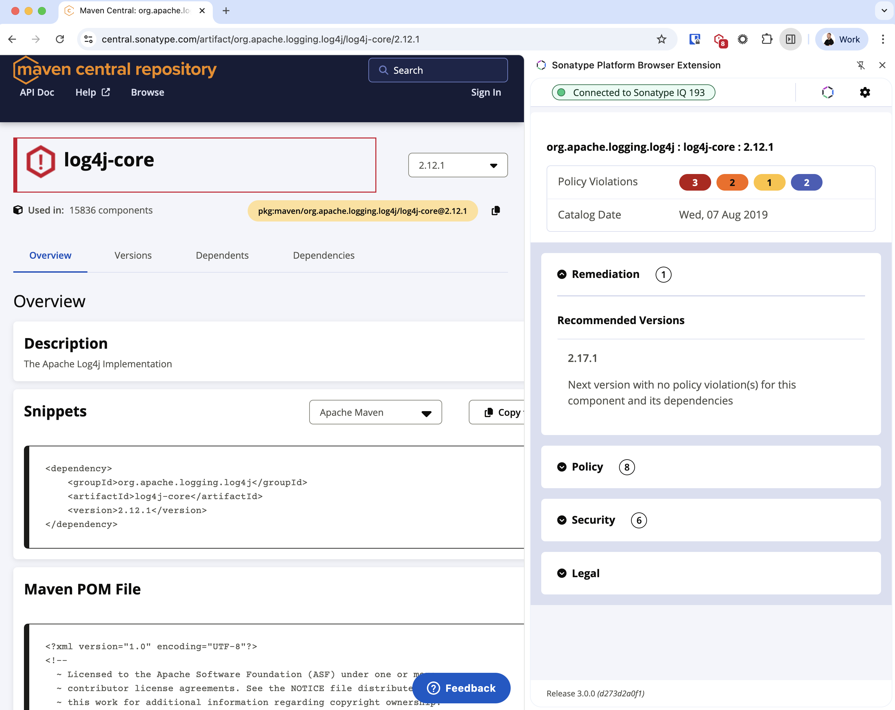

# Sonatype Platform Browser Extension

The Sonatype Platform Browser Extension supercedes the [Nexus IQ Evaluation Extension](https://chrome.google.com/webstore/detail/mjehedmoboadebjmbmobpedkdgenmlhd?authuser=0&hl=en-GB), and allows Developers to get insight from the [Sonatype Platform](https://www.sonatype.com/products/software-supply-chain-management) for Open Source packages as you browse Public Open Source Registries - i.e. before a package is even downloaded!

To use this extension you will need access to a licensed installation of either:

-   [Sonatype Lifecycle](https://www.sonatype.com/products/open-source-security-dependency-management)
-   A license with [Advanced Legal Pack](https://www.sonatype.com/products/advanced-legal-pack) provides additional license information
-   [Sonatype Repository Firewall](https://www.sonatype.com/products/sonatype-repository-firewall)

In all cases, Sonatype IQ Server versions 150 and newer have been confirmed as supported with this extension.

**Contents**

- [Format Support](#format-support)
  - [Public Registries](#public-registries)
  - [Private Hosted Registries](#private-hosted-registries)
  - [Missing or unsupported Registry?](#missing-or-unsupported-registry)
- [Installation](#installation)
  - [Installation on Chrome](#installation-on-chrome)
  - [Installation on Microsoft Edge](#installation-on-microsoft-edge)
- [Supported Languages](#supported-languages)
- [Configuration](#configuration)
- [Advanced Configuration](#advanced-configuration)
  - [Support for Sonatype Nexus Repository](#support-for-sonatype-nexus-repository)
- [Usage](#usage)
  - [Pinning the Extension](#pinning-the-extension)
  - [Opening the Extension](#opening-the-extension)
  - [Component Information](#component-information)
  - [Remediation Advice](#remediation-advice)
  - [Policy Violation(s)](#policy-violations)
  - [Known Security Issues](#known-security-issues)
  - [Open Source License(s)](#open-source-licenses)
- [Additional Feature Support](#additional-feature-support)
- [Caveats](#caveats)
  - [PyPi Packages with No Source Distribution](#pypi-packages-with-no-source-distribution)
- [Development](#development)
- [Uninstallation](#uninstallation)
- [Version History](#version-history)
- [The Fine Print](#the-fine-print)

## Format Support

### Public Registries

| Registry               | Language            | Enabled | URL                              | Component Version Navigation ^4 |
| ---------------------- | ------------------- | ------- | -------------------------------- | ------------------------------- |
| Alpine Linux           | Alpine Linux        | ✅      | `https://pkgs.alpinelinux.org/`  | ❌                              |
| Clojars                | Java                | ❌      | `https://clojars.org/`           | N/A                             |
| CocoaPods              | Swift / Objective-C | ✅      | `https://cocoapods.org/`         | ❌                              |
| Conan IO               | C / C++             | ✅      | `https://conan.io/center/`       | ✅                              |
| CRAN                   | R                   | ✅      | `https://cran.r-project.org`     | ❌                              |
| Crates.io              | Rust                | ✅      | `https://crates.io/`             | ✅                              |
| Go.dev                 | Go                  | ❌ ^1   | `https://pkg.go.dev/`            | N/A                             |
| Maven Central          | Java                | ✅      | `https://central.sonatype.com/`  | ✅                              |
| Maven Central (simple) | Java                | ✅      | `https://repo.maven.apache.org/` | ❌                              |
| Maven Central (simple) | Java                | ✅      | `https://repo1.maven.org/`       | ❌                              |
| Maven Central (old)    | Java                | ✅      | `https://search.maven.org/`      | ✅                              |
| MVN Repository         | Java                | ✅      | `https://mvnrepository.com/`     | ✅                              |
| NPM JS                 | Javascript          | ✅      | `https://www.npmjs.com/`         | ✅                              |
| NuGet Gallery          | .NET                | ✅      | `https://www.nuget.org/`         | ✅                              |
| Packagist              | PHP                 | ✅      | `https://packagist.org/`         | ✅                              |
| PyPI                   | Python              | ✅ ^3   | `https://pypi.org/`              | ✅                              |
| RubGems                | Ruby                | ✅      | `https://rubygems.org/`          | ✅                              |
| Spring.io              | Java                | ❌ ^2   | `https://repo.spring.io/list/`   | N/A                             |

_Notes:_

1. See issue [#36](https://github.com/sonatype-nexus-community/sonatype-platform-browser-extension/issues/36)
2. Run on a public instance of jFrog Artifactory - support coming soon
3. By default we lookup the Source Distribution. Where no Source Distribution is published we lookup the first Built Distribution - this can lead to an incomplete view of risk - [read more](#pypi-packages-with-no-source-distribution)

### Private Hosted Registries

Some public registires are hosted on instances of Sonatype Nexus Repository and jFrog Artifactory. You might also have private instances.

[Sonatype Nexus IQ Evaluation Extension](https://chrome.google.com/webstore/detail/mjehedmoboadebjmbmobpedkdgenmlhd) has support for both of these types, but this has yet to be ported to this extension.

### Missing or unsupported Registry?

Missing format or ecosystem? Why not raise an Issue to request?

## Installation

### Installation on Chrome

Visit [Chrome Web Store](https://chrome.google.com/webstore/detail/sonatype-platform-browser/kahnhlonadjlllgnilndafpajaiepdag) to add to Chrome.

### Installation on Microsoft Edge

Visit [Microsoft Edge Web Store](https://microsoftedge.microsoft.com/addons/detail/sonatype-platform-browser/eimppjecdnhdmdiohjnkbjgdeaecabmg) to add to Microsoft Edge.

## Supported Languages

Yes - you read right - we have localised this extension!

Currently we have translations for:

-   English 🇦🇺 🇬🇧 🇺🇸
-   Catalan 🇪🇸 🇦🇩
-   Chinese 🇨🇳 🇸🇬 🇭🇰 🇸🇬
-   Finnish 🇫🇮
-   French 🇫🇷 🇨🇭 🇨🇦 🇲🇨 🇧🇪
-   German 🇩🇪 🇦🇹 🇨🇭
-   Greek 🇬🇷 🇨🇾
-   Korean 🇰🇷 🇨🇳
-   Portuguese 🇧🇷 🇵🇹
-   Spanish 🇪🇸 🇲🇽 🇨🇴 🇦🇷
-   Taiwanese 🇹🇼

More are coming soon.

If you'd like to contribute a translation, please check the target locale you have in mind is supported by Chromium - [see this list](https://developer.chrome.com/docs/webstore/i18n/#choosing-locales-to-support).

## Configuration

Upon successfully addition of the Sonatype Platform Browser Extension, you'll automatically be shown the "Getting Started" screen to make the necessary configuration.

Enter the URL of your Sonatype IQ Server and click "Grant Permissions to your Sonatype IQ Server".

Click "Allow".

You can now enter your credentials for your Sonatype IQ Server and click "Connect". Upon successful authentication, you'll be provided a list of Applications you have permissions for in your Sonatype IQ Server - choose one!

That's it - you have configured the Sonatype Platform Browser Extension. You can close the configuration tab. If you need to make changes to the configuration

## Advanced Configuration

### Support for Sonatype Nexus Repository

If your organisation runs one or more instances of Sonatype Nexus Repository, you can add these under Advanced Options.

> **_NOTE:_** The Sonatype Nexus Repository instance must be accessible via `http://` or `https://`

When browsing Sonatype Nexus Repository instances you have added, this extension will look to provide insight for Open Source Components for the following format repositories:

-   CocoaPods
-   Maven (Java)
-   NPM (Javascript)
-   PyPi (Python)
-   R (CRAN)
-   RubyGems

## Usage

When you browse to a website that is supported by the Sonatype Platform Browser Extension, such as [Maven Central](https://central.sonatype.com/) the extension will assess the component you are viewing and alert you if there are known issues.

### Pinning the Extension

Extension by default are not always visible - we recommend you Pin the Sonatype Platform Browser Extension so it is easily accessible as you navigate. To do this find the "Extensions" icon in the top right of your browser (usually) as highlighed in red:

Then click the Pin icon as highlighted next to the Sonatype Platform Browser Extension.

You'll now always have the Sonatype Platform Browser Extension icon visible in the top right.

### Opening the Extension

As you browse supported registries, you'll notice the Sonatype Platform Browser Extension change colour to warn you when your Sonatype IQ Server reports issues for the component you are viewing.

To get the details behind the warning, click the Sonatype Platform Browser Extension icon (top right).

### Component Information

When you acess the Sonatype Platform Browser Extension, you'll be shown the information known by Sonatype about the component you are viewing.

### Remediation Advice

Accessing the "Remediation" tab will provide easy access to recommended versions along with a timeline of all known versions and how they stack up against your organisations policies in your Sonatype IQ Server.

For Open Source Registries that support navigation to specific versions, you can click on the Remediation or Version to have your browser navigate to that version easily.
See [this table](#public-registries) to see which Registries we have support for this.

### Policy Violation(s)

The "Policy" tab allows you to understand why your Organisational policies were violated - i.e. what caused the violations.

### Known Security Issues

The "Security" tab allows you to understand what known security issues affect the component you are viewing.

### Open Source License(s)

The "Legal" tab allows you to understand what open source licenses apply or might apply to the component you are viewing.

## Additional Feature Support

Current and future additional features are available based on the additional capabilities provided by your Sonatype Platform license. In addition to having the correct license installed at the Sonatype IQ Server, some features require that they be enabled.

[Advanced Legal Pack](https://help.sonatype.com/iqserver/product-information/add-on-packs/advanced-legal-pack-quickstart)

-   [Extended Observed License Detections](https://help.sonatype.com/iqserver/configuring/advanced-legal-pack-extended-observed-license-detections) - When enabled, the browser extenstion shows the observed licenses detected for that component.

## Caveats

### PyPi Packages with No Source Distribution

There are a few examples of projects published to PyPi (such as [mediapipe](https://pypi.org/project/mediapipe/)) that have not published a Source Distribution.

By default, when the Sonatype Platform Browser Extension looks up data on PyPi packages, we default to looking up information based on it's Source Distribution - 
this has no consideration as to your Python Version or Architecture.

When looking up data based on a Built Distribution, this can include the Python Version and/or Architecture, and this may not provide an accurate representation
of the risks associated with your use of the Package if your Python Version and/or Architrecture differ from the first Build Distribution in the list.

## Development

We use Node 18 and Yarn 1.22.x.

To get started developing:

-   clone the repo
-   `yarn`
-   `yarn build`

You can run `yarn test` as well to ensure everything is setup correctly!

All source code is in `src/` and follows a fairly normal React application setup.

## Uninstallation

To remove the Sonatype Platform Browser Extension, follow the instructions for your browser to remove it.

## Version History

Our version history is kept in our [change log](CHANGELOG.md).

## The Fine Print

Supported by Sonatype Inc.
