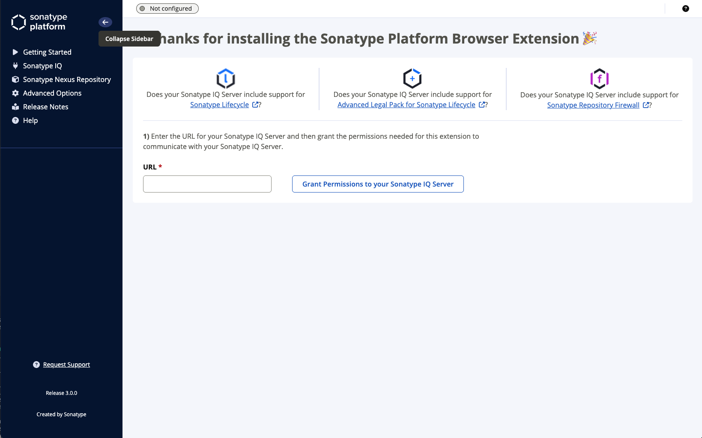

# Sonatype Platform Browser Extension

The Sonatype Platform Browser Extension supercedes the [Nexus IQ Evaluation Extension](https://chrome.google.com/webstore/detail/mjehedmoboadebjmbmobpedkdgenmlhd?authuser=0&hl=en-GB), and allows Developers to get insight from the Sonatype Platform for Open Source packages as you browse Public Open Source Registries - i.e. before a package is even downloaded!

**Contents**

- [Format Support](#format-support)
  - [Public Registries](#public-registries)
  - [Private Hosted Registries](#private-hosted-registries)
  - [Missing or unsupported Registry?](#missing-or-unsupported-registry)
- [Installation](#installation)
  - [Installation on Chrome](#installation-on-chrome)
- [Supported Languages](#supported-languages)
- [Configuration](#configuration)
- [Usage](#usage)
  - [Pinning the Extension](#pinning-the-extension)
  - [Opening the Extension](#opening-the-extension)
  - [Component Information](#component-information)
  - [Remediation Advice](#remediation-advice)
  - [Policy Violation(s)](#policy-violations)
  - [Known Security Issues](#known-security-issues)
  - [Open Source License(s)](#open-source-licenses)
- [Development](#development)
- [Uninstallation](#uninstallation)
- [Version History](#version-history)
- [The Fine Print](#the-fine-print)

## Format Support

### Public Registries

| Registry               | Language            | Enabled | URL                              | Sonatype Lifecycle |
| ---------------------- | ------------------- | ------- | -------------------------------- | ------------------ |
| Alpine Linux           | Alpine Linux        | ✅      | `https://pkgs.alpinelinux.org/`  | ✅                 |
| Clojars                | Java                | ❌      | `https://clojars.org/`           | ✅                 |
| CocoaPods              | Swift / Objective-C | ✅      | `https://cocoapods.org/`         | ✅                 |
| Conan IO               | C / C++             | ✅      | `https://conan.io/center/`       | ✅                 |
| CRAN                   | R                   | ✅      | `https://cran.r-project.org`     | ✅                 |
| Crates.io              | Rust                | ❌ ^1   | `https://crates.io/`             | ✅                 |
| Go.dev                 | Go                  | ❌ ^2   | `https://pkg.go.dev/`            | ✅                 |
| Maven Central          | Java                | ✅      | `https://central.sonatype.com/`  | ✅                 |
| Maven Central (simple) | Java                | ✅      | `https://repo.maven.apache.org/` | ✅                 |
| Maven Central (simple) | Java                | ✅      | `https://repo1.maven.org/`       | ✅                 |
| Maven Central (old)    | Java                | ✅      | `https://search.maven.org/`      | ✅                 |
| MVN Repository         | Java                | ✅      | `https://mvnrepository.com/`     | ✅                 |
| NPM JS                 | Javascript          | ✅      | `https://www.npmjs.com/`         | ✅                 |
| NuGet Gallery          | .NET                | ✅      | `https://www.nuget.org/`         | ✅                 |
| Packagist              | PHP                 | ✅      | `https://packagist.org/`         | ✅                 |
| PyPI                   | Python              | ✅      | `https://pypi.org/`              | ✅                 |
| RubGems                | Ruby                | ✅      | `https://rubygems.org/`          | ✅                 |
| Spring.io              | Java                | ❌ ^3   | `https://repo.spring.io/list/`   | ✅                 |

_Notes:_

1. See issue [#237](https://github.com/sonatype-nexus-community/nexus-iq-chrome-extension/issues/237)
2. See issue [#130](https://github.com/sonatype-nexus-community/nexus-iq-chrome-extension/issues/130)
3. Run on a public instance of jFrog Artifactory - support coming soon

### Private Hosted Registries

Some public registires are hosted on instances of Sonatype Nexus Repository and jFrog Artifactory. You might also have private instances.

[Sonatype Nexus IQ Evaluation Extension](https://chrome.google.com/webstore/detail/mjehedmoboadebjmbmobpedkdgenmlhd) has support for both of these types, but this has yet to be ported to this extension.

### Missing or unsupported Registry?

Missing format or ecosystem? Why not raise an Issue to request?

## Installation

### Installation on Chrome

Visit [Chrome Web Store](https://chrome.google.com/webstore/detail/sonatype-platform-browser/kahnhlonadjlllgnilndafpajaiepdag) to add to Chrome.

## Supported Languages

Yes - you read right - we have localised this extension!

Currently we have translations for:

-   English 🇦🇺 🇬🇧 🇺🇸
-   Finnish 🇫🇮
-   French 🇫🇷 🇨🇭 🇨🇦 🇲🇨 🇧🇪
-   German 🇩🇪 🇦🇹 🇨🇭
-   Korean 🇰🇷 🇨🇳

More are coming soon.

If you'd like to contribute a translation, please check the target locale you have in mind is supported by Chromium - [see this list](https://developer.chrome.com/docs/webstore/i18n/#choosing-locales-to-support).

## Configuration

Upon successfully addition of the Sonatype Platform Browser Extension, you'll automatically be shown the "Getting Started" screen to make the necessary configuration.

Enter the URL of your Sonatype IQ Server and click "Grant Permissions to your Sonatype IQ Server".

Click "Allow".

You can now enter your credentials for your Sonatype IQ Server and click "Connect". Upon successful authentication, you'll be provided a list of Applications you have permissions for in your Sonatype IQ Server - choose one!

That's it - you have configured the Sonatype Platform Browser Extension. You can close the configuration tab. If you need to make changes to the configuration

## Usage

When you browse to a website that is supported by the Sonatype Platform Browser Extension, such as [Maven Central](https://central.sonatype.com/) the extension will assess the component you are viewing and alert you if there are known issues.

### Pinning the Extension

Extension by default are not always visible - we recommend you Pin the Sonatype Platform Browser Extension so it is easily accessible as you navigate. To do this find the "Extensions" icon in the top right of your browser (usually) as highlighed in red:

Then click the Pin icon as highlighted next to the Sonatype Platform Browser Extension.

You'll now always have the Sonatype Platform Browser Extension icon visible in the top right.

### Opening the Extension

As you browse supported registries, you'll notice the Sonatype Platform Browser Extension change colour to warn you when your Sonatype IQ Server reports issues for the component you are viewing.

To get the details behind the warning, click the Sonatype Platform Browser Extension icon (top right).

### Component Information

When you acess the Sonatype Platform Browser Extension, you'll be shown the information known by Sonatype about the component you are viewing.

### Remediation Advice

Accessing the "Remediation" tab will provide easy access to recommended versions along with a timeline of all known versions and how they stack up against your organisations policies in your Sonatype IQ Server.

### Policy Violation(s)

The "Policy" tab allows you to understand why your Organisational policies were violated - i.e. what caused the violations.

### Known Security Issues

The "Security" tab allows you to understand what known security issues affect the component you are viewing.

### Open Source License(s)

The "Legal" tab allows you to understand what open source licenses apply or might apply to the component you are viewing.

## Development

We use Node 18 and Yarn 1.22.x.

To get started developing:

-   clone the repo
-   `yarn`
-   `yarn build`

You can run `yarn test` as well to ensure everything is setup correctly!

All source code is in `src/` and follows a fairly normal React application setup.

## Uninstallation

To remove the Sonatype Platform Browser Extension, follow the instructions for your browser to remove it.

## Version History

Our version history is kept in our [change log](CHANGELOG.md).

## The Fine Print

Supported by Sonatype Inc.
