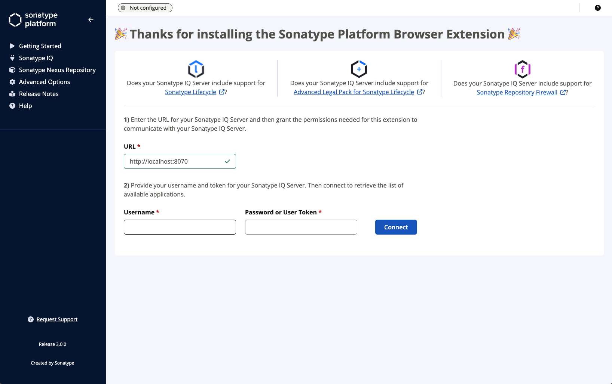
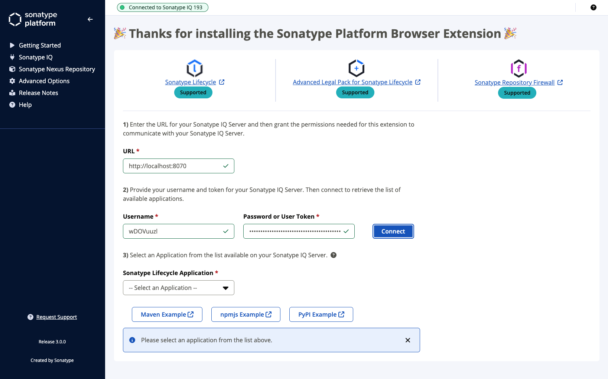

Upon successfull installation of the Sonatype Platform Browser Extension, you'll automatically be shown the "Getting Started" screen to make the necessary configuration.

## Configure Sonatype IQ Server

### Connect

Enter the URL of your Sonatype IQ Server and click "Grant Permissions to your Sonatype IQ Server". You will then be prompted by your Browser to accept or reject the permission request.

Click "Allow" to grant the Sonatype Platform Browser Extension the required permissions.

### Authenticate

You can now enter your credentials for your Sonatype IQ Server and click "Connect". 

> [!NOTE]
> It is recommended that you use your [User Token](https://help.sonatype.com/en/iq-server-user-tokens.html){:target="_blank"} in preference of your username/password credentials.

### Application Selection

Once successfully authenticated, you will be presented with a list of Sonatype IQ Applications to choose from. Select an Application.

> [!TIP]
> Component warnings from this Extension are driven by the Policy Violations applicable to the Application selected.

## Advanced Configuration

You can read more about the following advanced configuiration options:

- [Configuring External Repository Managers](./configure-external-repository-managers.html)
- [Advanced Options](./configure-advanced-options.html)