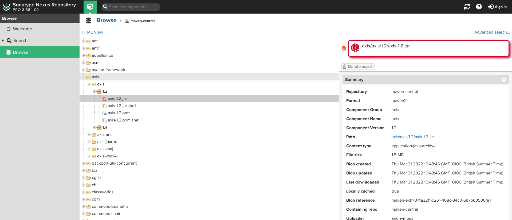

Upon successfull installation of the Sonatype Platform Browser Extension, you'll automatically be shown the "Getting Started" screen to make the necessary configuration.

## Initial Configuration

### Connect to Sonatype IQ Server

Enter the URL of your Sonatype IQ Server and click "Grant Permissions to your Sonatype IQ Server". You will then be prompted by your Browser to accept or reject the permission request.

Click "Allow" to grant the Sonatype Platform Browser Extension the required permissions.

Click "Allow".

You can now enter your credentials for your Sonatype IQ Server and click "Connect". Upon successful authentication, you'll be provided a list of Applications you have permissions for in your Sonatype IQ Server - choose one!

That's it - you have configured the Sonatype Platform Browser Extension. You can close the configuration tab. If you need to make changes to the configuration

## Advanced Configuration

### Support for Sonatype Nexus Repository

If your organisation runs one or more instances of Sonatype Nexus Repository, you can add these under Advanced Options.

> **_NOTE:_** The Sonatype Nexus Repository instance must be accessible via `http://` or `https://`

When browsing Sonatype Nexus Repository instances you have added, this extension will look to provide insight for Open Source Components for the following format repositories:

-   CocoaPods
-   Maven (Java)
-   NPM (Javascript)
-   PyPi (Python)
-   R (CRAN)
-   RubyGems

