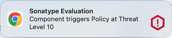

[&lt; Back]({{ 'configuration.html' | relative_url }})

The following advanced options are configurable.

## Notifications

By default, since `3.0.0`, the Sonatype Platform Browser Exstension with utilise System Notifications to alert you when browsing Open Source Registries and an Identified Component triggers Policy.

This behaviour can be disabled by unticking the option to "Enable Notifications".

## Page Annotations

By default, the Sonatype Platform Browser Extension automatically annotates Open Source Registry pages when an Identified Component triggers Policy.

This behaviour can be disabled by unticking the option to "Enable Page Annotations".

## Log Level

The default Logging Level is `WARN`. If requested by Sonatype Support or Sonatype Community when engaging for assistance, we may request you increase this logging level.

You can view log entires in the Browser Console.