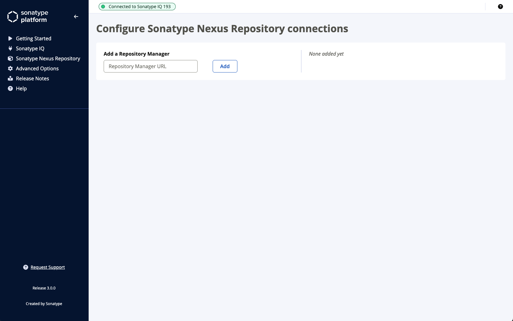
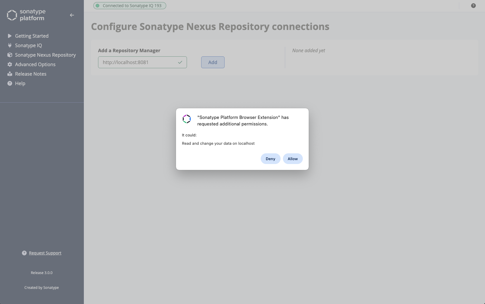
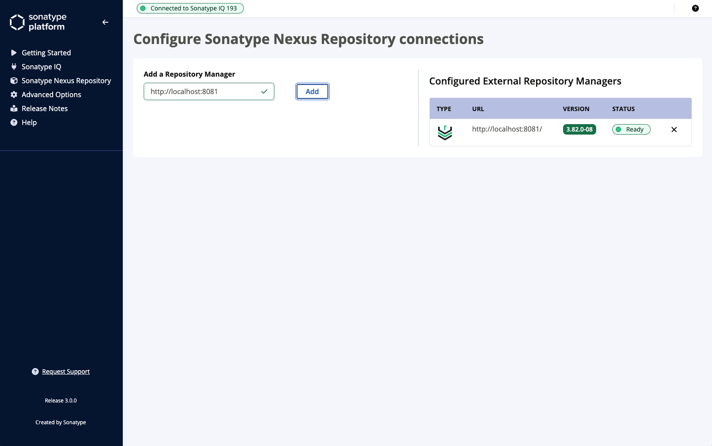

[&lt; Back]({{ 'configuration.html' | relative_url }})

If your organisation runs one or more installations of [Sonatype Nexus Repository](https://www.sonatype.com/products/sonatype-nexus-repository){:target="_blank"}, you can add these under "Sonatype Nexus Repository" options menu.

## Adding a Repository Manager

Enter the URL of your Sonatype Nexus Repository and click "Add". You will then be prompted by your Browser to accept or reject the permission request.

Click "Allow" to grant the Sonatype Platform Browser Extension the required permissions to this Repository Manager.

Once added (this can take a few seconds if the Repository Manager is remote to you), it will be listed along with version and status.

## Removing a Repository Manager

You can simply click the "X" icon next to a configured Repository Manager to remove it.