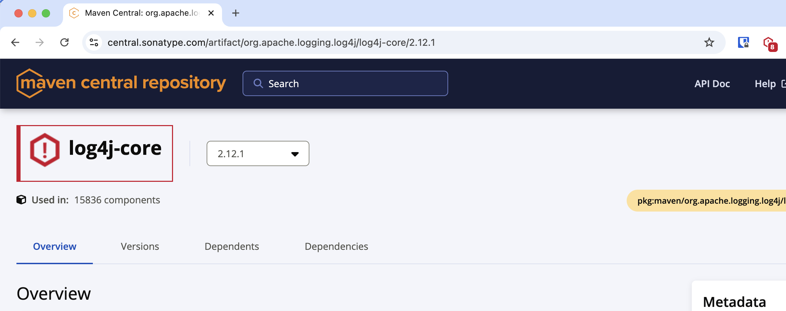

When you browse to a website that is supported by the Sonatype Platform Browser Extension, such as [Maven Central](https://central.sonatype.com/){:target="_blank"} the extension will assess the component you are viewing and alert you if there are known issues.

### Pinning the Extension

Extension by default are not always visible - we recommend you Pin the Sonatype Platform Browser Extension so it is easily accessible as you navigate. To do this find the "Extensions" icon in the top right of your browser (usually) as highlighed in red:

Then click the Pin icon as highlighted next to the Sonatype Platform Browser Extension.

You'll now always have the Sonatype Platform Browser Extension icon visible in the top right.

### Opening the Extension

As you browse supported registries, you'll notice the Sonatype Platform Browser Extension change colour to warn you when your Sonatype IQ Server reports issues for the component you are viewing.

To get the details behind the warning, click the Sonatype Platform Browser Extension icon (top right), or the Notification if you have those enabled (see [Advanced Options]({{ 'configure-advanced-options.html' | relative_url }})).

### Component Details Side Panel

When you acess the Sonatype Platform Browser Extension, you'll be shown the information known by Sonatype about the component you are viewing.

This includes sub-sections:

#### Remediation Advice

Accessing the "Remediation" accordion will provide easy access to recommended versions based on your organisations policies in your Sonatype IQ Server.

This will include [Golden Version](https://help.sonatype.com/en/component-details-page.html#golden-version){:target="_blank"} where available.

#### Policy Violation(s)

The "Policy" accordion allows you to understand why your Organisational policies were violated - i.e. what caused the violations.

#### Known Security Issues

The "Security" accordion allows you to understand what known security issues affect the component you are viewing.

You can click on a Security Issue to directly access Sonatype's Vulnerability Intelligence:

Each of the accordions can be expanded to get deep insight into the Security Issue.

#### Open Source License(s)

The "Legal" accordion allows you to understand what open source licenses apply or might apply to the component you are viewing.

### Multiple Components Identified

For some supported Open Source Registries, on a single page there may be multiple Component Identities available. Where multiple Component identities are discovered, you'll be show an additional Component Selector in the Side Panel:

